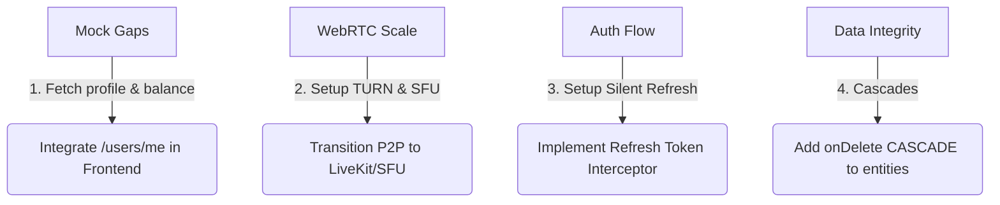

# findpals Production Gap Analysis & Audit Report

This report documents the architectural, security, and integration gaps identified across the **findpals** codebase (`apps/frontend`, `apps/backend`, and `infra`). It highlights structural issues that must be resolved before the platform is fully ready for a 1M+ user production environment.

---

## 1. Frontend Integration Gaps (Mock Data / Dead Ends)

### 🔴 The `users.getMyProfile` Call is Never Used
*   **File:** `apps/frontend/src/services/api.ts` (line 49)
*   **Issue:** The frontend defines a `getMyProfile()` API endpoint, but it is **never called** anywhere in the React app.
*   **Impact:** The user's pseudonym, level, XP, and wallet balance are never fetched from the NestJS backend. When a user logs in, the UI displays default mock values instead of their real database profile.

### 🔴 Hardcoded Wallet Balance & Mock Transactions
*   **File:** `apps/frontend/src/pages/WalletPage.tsx`
*   **Issue:** The user's balance is hardcoded to `$1250.50` (`const [balance, setBalance] = useState(1250.50)`). Recent transactions are mocked using a static array: `[1, 2, 3].map(...)`.
*   **Impact:** While Flutterwave deposits actually update the backend database, the user will **never see their new balance or transaction history** on the frontend because it is never fetched.

### 🔴 Hardcoded Creator Analytics & Level Progressions
*   **File:** `apps/frontend/src/pages/CreatorHub.tsx`
*   **Issue:** The total balance is hardcoded to `$12,450.80`, current level to `12`, active streaks to `12 Days`, and subscription plans are hardcoded arrays.
*   **Impact:** Even if a user receives tips or gains XP from backend gamification triggers, the Creator Hub remains completely static.

---

## 2. Live-Streaming & WebRTC Limitations (A Major Scaling Blocker)

### ⚠️ Lack of a TURN Server
*   **File:** `apps/frontend/src/pages/LiveStreamPage.tsx`
*   **Issue:** The WebRTC `RTCPeerConnection` is initialized using only a public Google STUN server:
    ```typescript
    iceServers: [{ urls: ['stun:stun.l.google.com:19302'] }]
    ```
*   **Impact:** In production, **up to 50% of users** (especially those on 4G/5G mobile networks or behind office/university firewalls) will not be able to establish a video connection. A TURN server (e.g., Coturn or Twilio Network Traversal) is mandatory for NAT traversal.

### ⚠️ Peer-to-Peer (P2P) Live Streaming is Unscalable
*   **File:** `apps/frontend/src/pages/LiveStreamPage.tsx` / `apps/backend/src/modules/live-stream/live-stream.gateway.ts`
*   **Issue:** The streaming logic is designed as basic P2P WebRTC.
*   **Impact:** A broadcaster's mobile device cannot upload 50 concurrent WebRTC video feeds to 50 viewers. P2P streaming will crash the broadcaster's browser/bandwidth with more than 3-5 concurrent viewers. To scale to thousands of concurrent viewers, you need an **SFU (Selective Forwarding Unit)** like LiveKit or Janus.

---

## 3. Session & JWT Lifecycle Gaps

### ⚠️ Lack of Refresh Tokens
*   **Issue:** The backend issues a JWT access token that expires in a set time (usually 1 hour). There is **no refresh token rotation flow** or interceptor in the frontend.
*   **Impact:** Once the access token expires, the user's API requests will suddenly start throwing `401 Unauthorized` errors. The frontend doesn't handle this gracefully, forcing users to log in again every hour.

---

## 4. Database Cascading & Cascade Deletion Issues

### ⚠️ Missing Cascade Deletes on Entities
*   **Files:** `apps/backend/src/entities/*.entity.ts`
*   **Issue:** Relations (e.g., `Message`, `Post`, `Comment`, `Follow`, `Session`) are linked to the `User` entity but do not have `onDelete: 'CASCADE'` defined.
*   **Impact:** If a user deletes their account (or an admin deletes a spammer), the Postgres database will throw a foreign key constraint violation error and fail, because related posts and comments are still linked to that user.

---

## 5. Summary Action Plan to Reach Production-Ready Status



1.  **Wire up Profile fetching**: Add a global `UserContext` in the React frontend that calls `users.getMyProfile()` on mount, and replace all mock balances/levels with real state.
2.  **Add TURN Servers**: Provision a Coturn server or use a service like Twilio/Xirsys to add TURN credentials to `RTCPeerConnection`.
3.  **Implement SFU**: For production streaming, replace the manual WebRTC gateway with an open-source SFU like **LiveKit**.
4.  **Database Cascades**: Add `onDelete: 'CASCADE'` to the `@ManyToOne()` relations in the NestJS entities.
